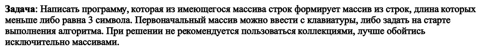
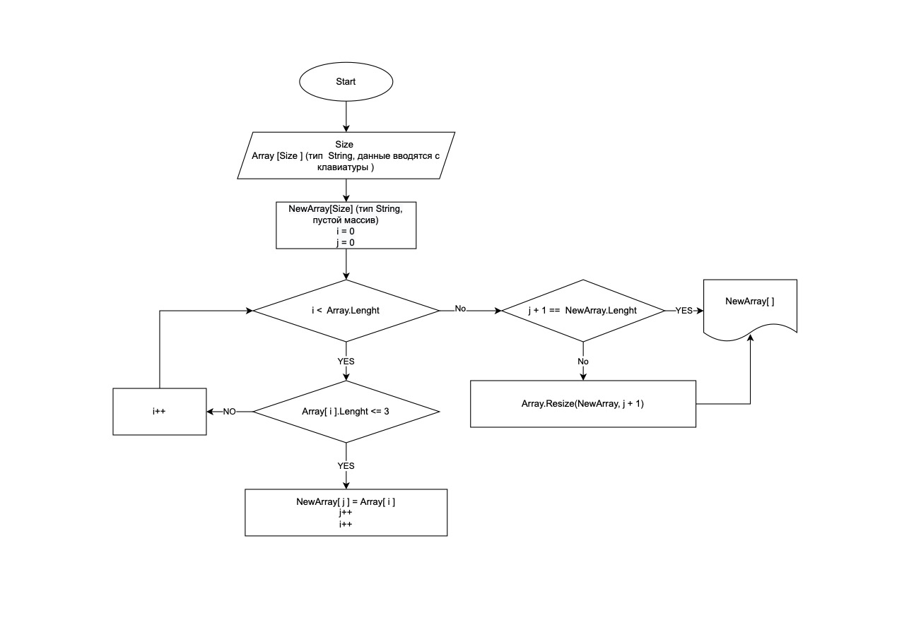

# Решение задачи итоговой проверочной работы
## *Описание задания:*

Перед началом написания кода был составлен алгоритм в виде блок-схемы:

## Алгоритм решения:

1. Создаем два массива(первый заполняется пользователем и второй пустой масссив) и переменные __i__ и __j__, где i - счетчик индексов основного массива (*Array*) и j - счетчик индексов нового массива(*NewArray*).
2. Создаем цикл, для перебора всех значений основного массива и в этом цикле проверяем удовлетворяют ли значение условию задачи.
3. Далее проверяем нет ли в массиве пустых значений(т.к. изначально длины массивов совпадают). Если они есть, то сокращаем длину массива.
4. Выводим результирующий массив.

